# AbuSESer - Trufflenet Lab

| | |
|---|---|
| **Platform** | CyberDefenders |
| **Category** | Cloud Forensics |
| **Difficulty** | Medium |
| **Date** | 2026-06-29 |
| **Author** | Siddhartha Mallipeddi |

## Overview

On January 23, 2026, Maromalix's finance department received an alarming call from TechCorp Industries, a long-standing client. TechCorp's accounts payable team reported they had processed a wire transfer to what they believed was Maromalix's bank account after receiving an invoice for services rendered. However, Maromalix had not issued any such invoice to TechCorp.

During the week prior to the incident, Maromalix onboarded a new cloud administrator. During this transition period, several IAM permission adjustments were made as users reported access issues with various services. Some of these changes may have resulted in overly permissive policies—activity related to these legitimate administrative actions may appear in the logs.

As a cloud security analyst, you have been engaged to investigate this potential Business Email Compromise (BEC) attack. Your primary investigation tool will be AWS CloudWatch Logs Insights—use it to query CloudTrail and Lambda execution logs, reconstruct the attack timeline, and identify indicators of compromise.

## Questions & Answers

### Q1. During the initial threat hunting phase, analysis of CloudTrail logs revealed API calls from multiple source IP addresses. One IP address stood out as highly suspicious due to its association with multiple identities and offensive security tooling. What is this attacker's IP address?

**Answer:** `52.59.194.168`

As the scan is performed with no user it should show up as anonymous as its publicly facing S3

AWS Query:
fields @timestamp, sourceIPAddress as IP_Address, userIdentity.accountId as Account_ID, eventName, userIdentity.userName as User_Name
| sort @timestamp asc

---

### Q2. The attacker's first action was to probe for publicly accessible resources. What is the full name of the S3 bucket they discovered?

**Answer:** `maromalix-website-assets-prod-83c9fdc8`

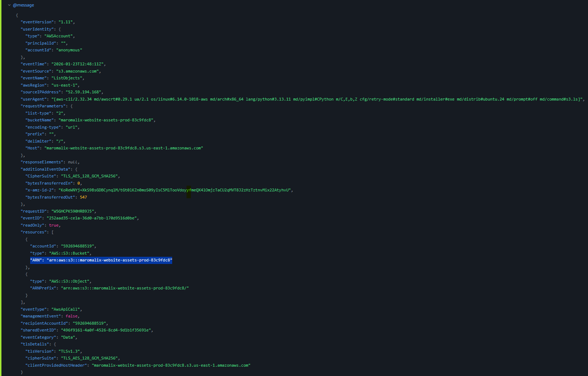

---

### Q3. The attacker used a tool designed to scan repositories and file systems for exposed secrets, then automatically validate any discovered credentials. What is the name of this tool?

**Answer:** `TruffleHog`

Filter the Log Analytics search to the Ip address discovered earlier and you can find below log listing the tool and Username

AWS Query:
fields @timestamp, sourceIPAddress as IP_Address, userIdentity.accountId as Account_ID, eventName, userIdentity.userName as User_Name
| sort @timestamp asc
| where IP_Address == "52.59.194.168"

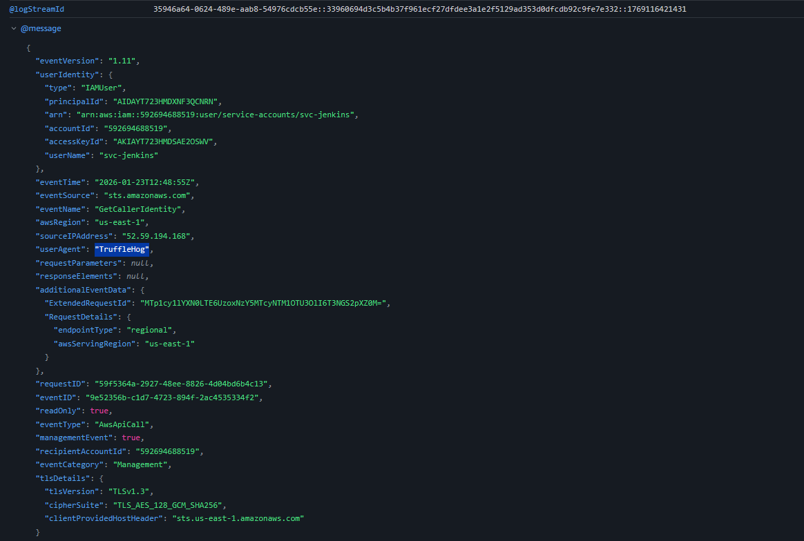

---

### Q4. The credentials discovered by the attacker belonged to a service account. What is the name of this initially compromised user?

**Answer:** `svc-jenkins`

Same log lists the username that's being validated

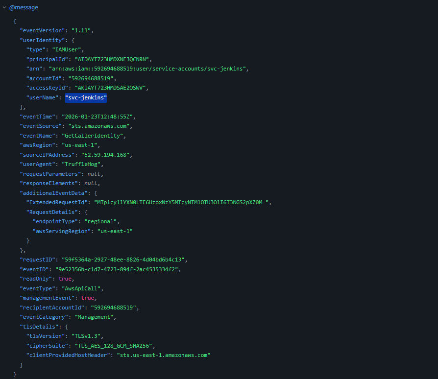

---

### Q5. To systematically enumerate the AWS environment and discover potential privilege escalation paths, the attacker used an open-source cloud exploitation framework. Provide the name and version of this tool as recorded in the logs.

**Answer:** `Pacu/1.5.2`

Filter your search for User agents. you should be able to see different user agents when you google about Pacu github page provide info  "Pacu is an open-source AWS exploitation framework"

AWS Query: 
fields @timestamp, sourceIPAddress as IP_Address, userIdentity.accountId as Account_ID, eventName, userIdentity.userName as User_Name, userAgent
| sort @timestamp asc
| where IP_Address == "52.59.194.168"

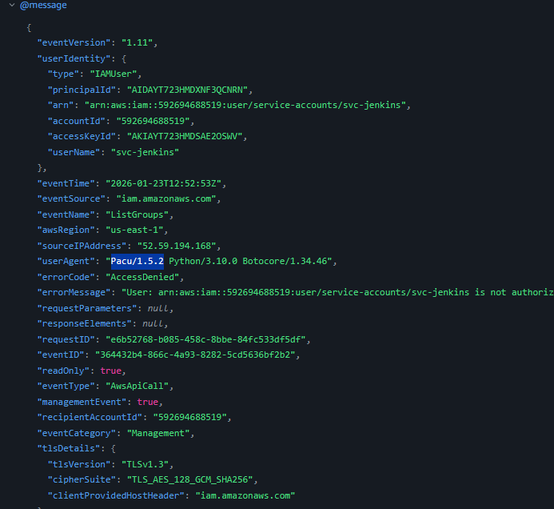

---

### Q6. The attacker discovered an overly permissive trust policy and escalated their privileges. What is the name of the first role the attacker successfully assumed?

**Answer:** `Maromalix-DevOps-Role`

Filter AWS query to look for eventName with AssumeRole as filter and you will find one log

AWS Query:
fields @timestamp, sourceIPAddress as IP_Address, userIdentity.accountId as Account_ID, eventName, userIdentity.userName as User_Name
| sort @timestamp asc
| where IP_Address == "52.59.194.168" and eventName == "AssumeRole"

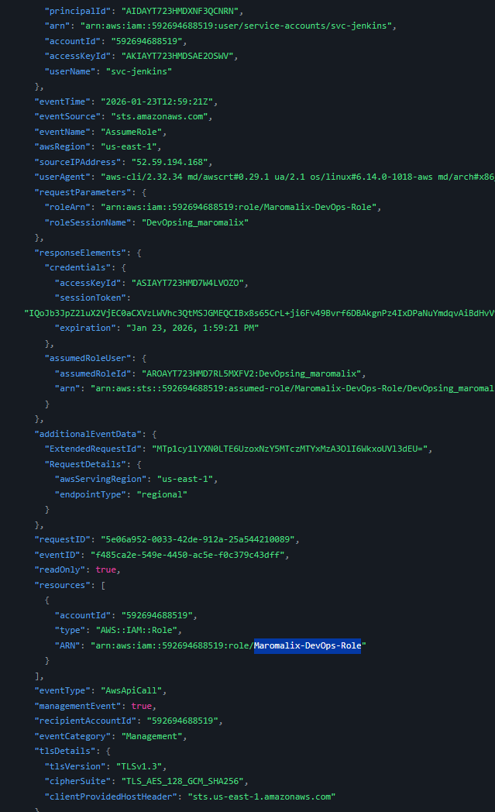

---

### Q7. When assuming the new role, the attacker specified a custom session name to identify their session. What was this session name?

**Answer:** `DevOpsing_maromalix`

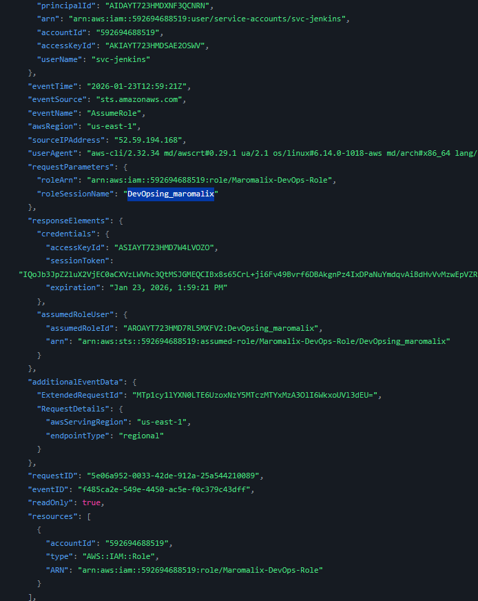

---

### Q8. With elevated privileges, the attacker enumerated several AWS services looking for sensitive data. Which AWS service did they successfully query to discover stored credentials and secrets?

**Answer:** `secretsmanager`

look for logs with eventname = "GetSecretValue"

---

### Q9. After discovering the secrets inventory, the attacker began exfiltrating credentials. What is the ID of the first secret the attacker retrieved?

**Answer:** `maromalix/automation/ssm-credentials`

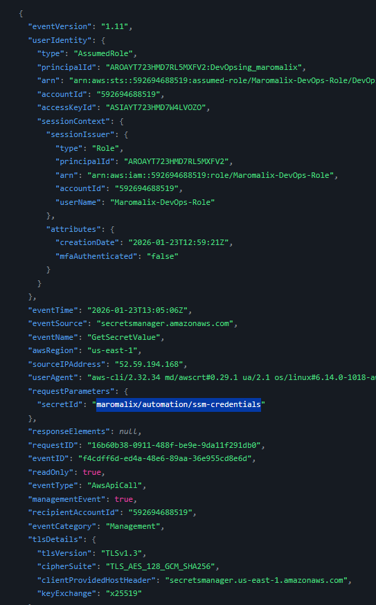

---

### Q10. What is the MITRE ATT&CK technique ID that corresponds to this credential exfiltration behavior?

**Answer:** `T1555.006`

---

### Q11. Using credentials obtained from the exfiltrated secrets, the attacker pivoted to a different IAM role. What is the full name of this role?

**Answer:** `Maromalix-SSM-Automation-Role`

If you review logs in chronological order you can see a log where GetCallerIdentity is leveraged

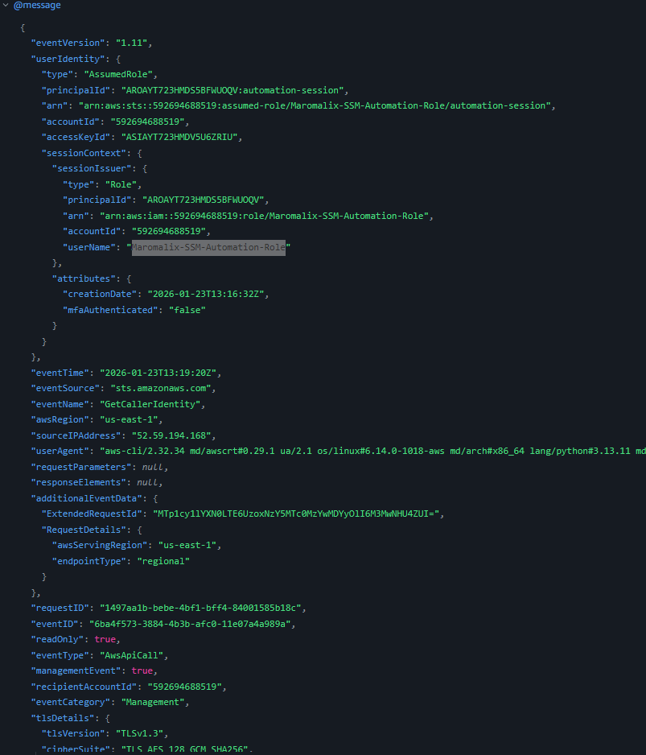

---

### Q12. The attacker used their new role to remotely execute commands on an EC2 instance and steal its IAM credentials via the Instance Metadata Service (IMDS). Provide the API call used to execute commands and the instance ID of the compromised machine, separated by a comma.

**Answer:** `SendCommand, i-0afb277aeec0e6fa4`

Filter for logs with event name as Send command

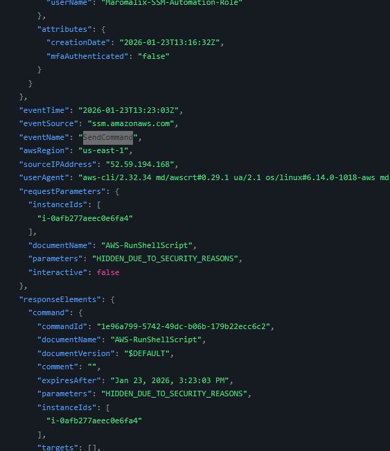

---

### Q13. With EC2 instance credentials, the attacker enumerated Lambda functions by downloading their configurations and code. What is the name of the first Lambda function the attacker retrieved?

**Answer:** `maromalix-daily-backup`

Look for event names that start with Get function

---

### Q14. After examining multiple functions, the attacker identified one suitable for their attack. What is the name of the Lambda function he used to send fraudulent emails?

**Answer:** `maromalix-email-notifications`

Same as above piece but sort it by timestamps

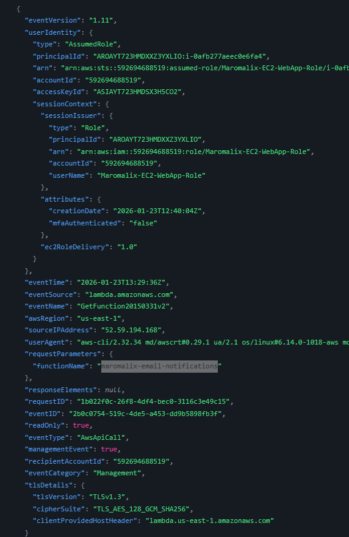

---

### Q15. The attacker sent fraudulent emails to two recipients. Provide both email addresses separated by a comma, with the internal recipient first.

**Answer:** `billing@maromalix.cloud, billing@techcorp.live`

Filter for event_type  == "EMAIL_SEND_ATTEMPT" then filter based on to addresses. Upon review you will find above email addressed recived those emails

AWS Query:

fields @timestamp, event_type, from, to
| sort to asc
| where event_type  == "EMAIL_SEND_ATTEMPT"

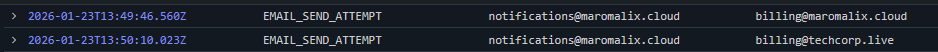

---

### Q16. The fraudulent invoice included attacker-controlled contact email addresses. What are the two domains used for these contact addresses? (Provide both domains separated by a comma, in alphabetical order)

**Answer:** `cfp-impactaction.com, zoominfopay.com`

Check the body of the Email

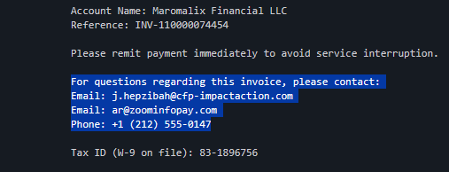

---

### Q17. The attacker's ultimate goal was to deceive the victim into transferring funds via a fraudulent invoice. What is the MITRE ATT&CK technique ID that corresponds to this impact?

**Answer:** `T1657`

---

### Q18. Based on the tools, TTPs, and infrastructure patterns observed in this investigation, this incident matches a known threat campaign. What is the name of this campaign?

**Answer:** `TruffleNet`

---

Generated with CTF Writeup Builder