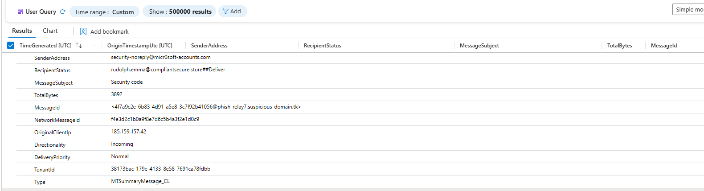
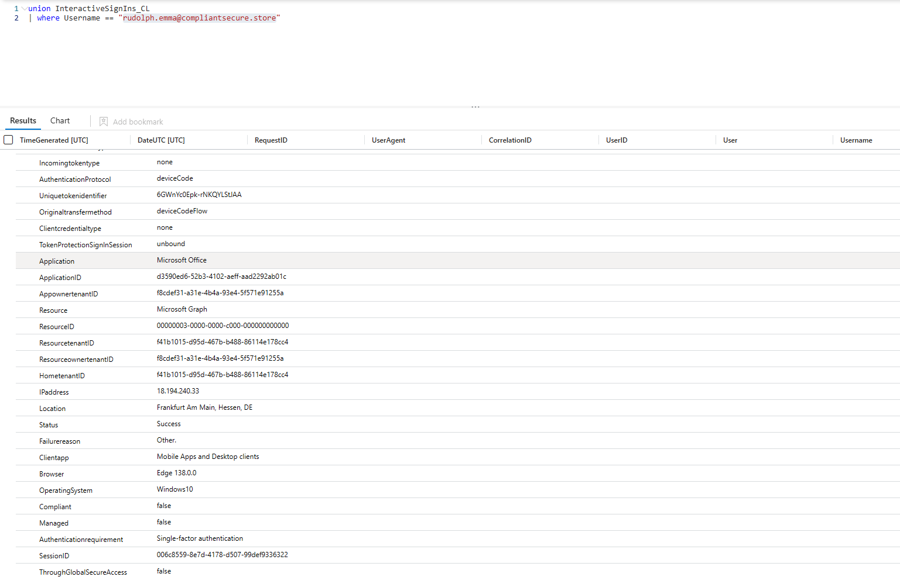
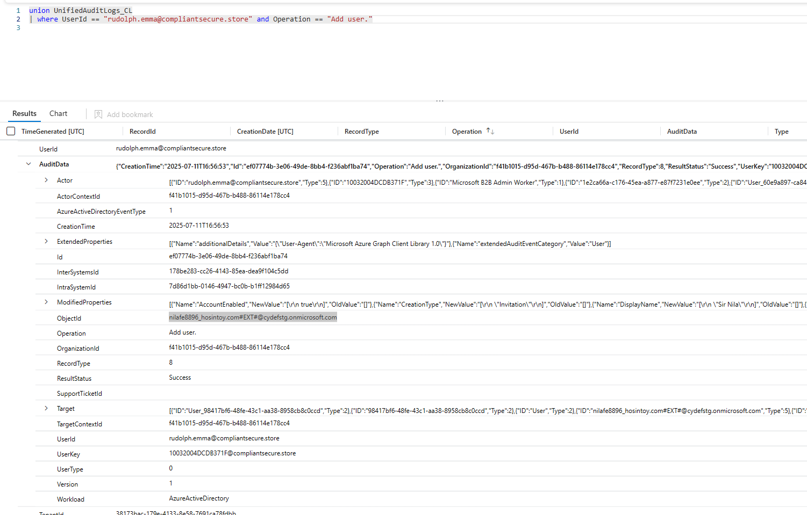
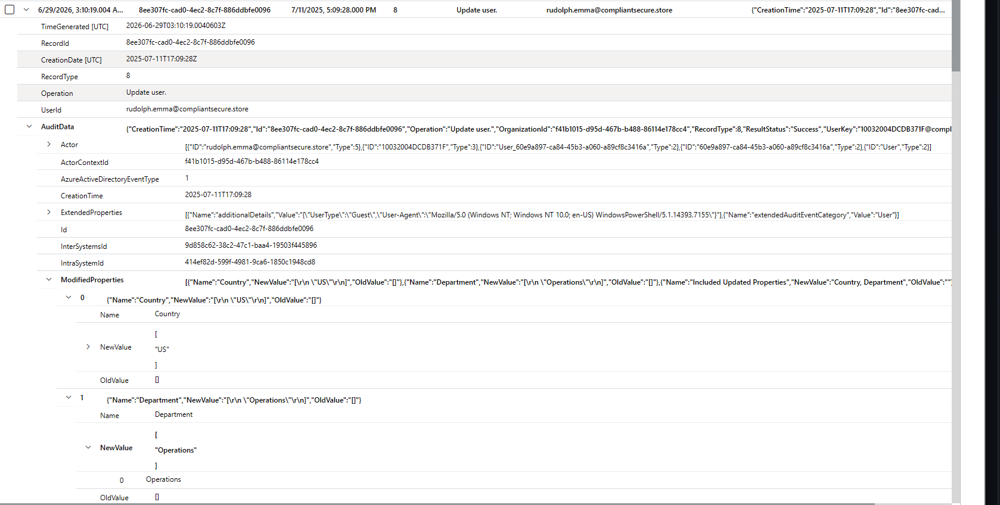
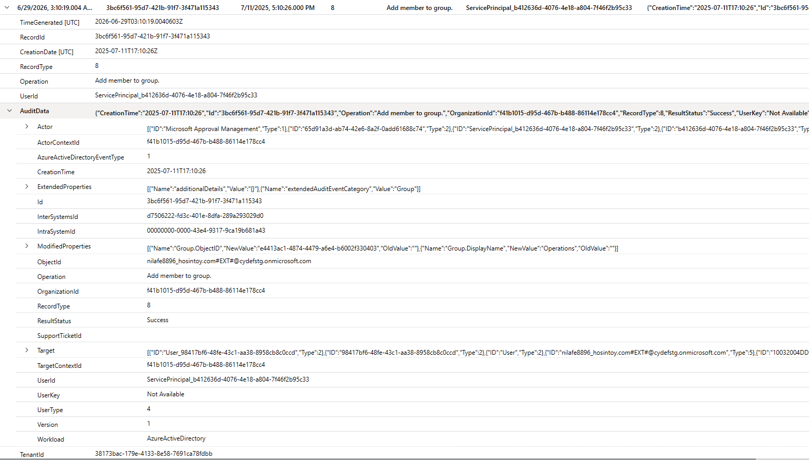

# DynamicEscalate Lab

| | |
|---|---|
| **Platform** | CyberDefenders |
| **Category** | Cloud Forensics |
| **Difficulty** | Medium |
| **Date** | 2026-06-29 |
| **Author** | Siddhartha Mallipeddi |

## Overview

Something feels off. A few users in your organization have recently gained access to sensitive resources through what appears to be legitimate Azure AD group membership. The security team flagged an anomaly: a dynamic group seems to have been quietly reconfigured. There's no clear breach, but the group membership rules don’t match what they used to be.

Using Azure AD logs, Microsoft Sentinel, and Graph API traces, your task is to piece together the timeline, identify what changed, who made it, and determine whether this was an administrative misstep or a calculated privilege escalation attempt using dynamic groups.

## Questions & Answers

### Q1. While reviewing Microsoft Sentinel logs during an investigation into suspicious changes, you pivot to Exchange message-trace for the lure. Which email Subject line confirmed the phishing message that kicked off the attack?

**Answer:** `Security code`

If you focus on the senders you could see its potential phishing email

---

### Q2. Correlating mail delivery with Azure AD logs, you isolate the first attacker log-on. List the authentication protocol and client application that reveal abuse of the device-code flow.

**Answer:** `deviceCode, Mobile Apps and Desktop clients`

Since we now know user: rudolph.emma@compliantsecure.store received phishing email. So look for sign in logs filtering for the potential compromised user. You can notice logins to browser and Monile app.

---

### Q3. Geo-enrichment shows the sign-in came from an unfamiliar location. What public IP address presented the stolen token?

**Answer:** `18.194.240.33`

You can see IP address from the same log that provided Authentication Protocol

---

### Q4. Precise timing is critical for scoping the blast radius. What UTC timestamp marks the attacker’s first successful device-code sign-in?

**Answer:** `2025-07-11 16:50`

Same log provides this information

---

### Q5. Minutes later, logs show a new external identity being invited. What guest UPN did the attacker create for persistence?

**Answer:** `nilafe8896_hosintoy.com#EXT#@cydefstg.onmicrosoft.com`

Go to Audit logs filter for the User: user: rudolph.emma@compliantsecure.store  and for Operation Add user you could see target username

---

### Q6. Still tracking the guest’s lifecycle, you notice it being ‘groomed’ to satisfy a dynamic-group rule. List the two attributes and their new values set on the guest account.

**Answer:** `country=US, department=Operations`

Keep reviewing Audit logs for Update user after the successful login to look for updated attributes after user was invited

---

### Q7. Seconds later, the dynamic-group engine fires. Provide the group name that auto-enrolled the guest and the application identity recorded as the actor.

**Answer:** `Operations,Microsoft Approval Management`

Again keep reviewing Audit logs and look for Add member to group

---

Generated with CTF Writeup Builder
