# Shadow Token Symphony - APT29

| | |
|---|---|
| **Platform** | CyberDefenders |
| **Category** | Cloud Forensics |
| **Difficulty** | Hard |
| **Date** | 2026-07-02 |
| **Author** | Siddhartha Mallipeddi |

## Overview

InfiniteTechSolutions recently experienced suspicious activity in their Azure environment. Using Microsoft Sentinel, the security team detected unusual login patterns, unauthorized service installations, and anomalous API calls targeting their Microsoft Graph endpoint. Multiple user accounts appear to have been compromised, and there are signs of privilege escalation and persistent access mechanisms being established. The incident occurred in July 2025, with activities spanning across various systems including workstations and cloud services.

## Questions & Answers

### Q1. Analyze the Windows Event logs to identify the scope of initial reconnaissance activities. How many distinct computer names experienced login failures?

**Answer:** `4`

Windows Event ID for failed Logins is 4625 so filter for that.

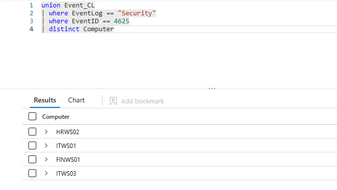

---

### Q2. During the initial compromise phase, which machine appears to be the primary target based on the volume of failed authentication attempts?

**Answer:** `ITWS01`

Same query just summarize computer by count to get the count for most occurrence

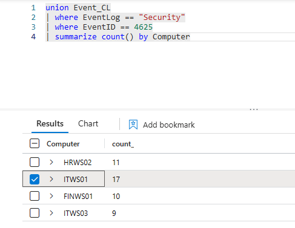

---

### Q3. Investigate service installation activities on the compromised machine. What is the name of the suspicious service that was installed?

**Answer:** `c316a11`

filter for security event logs with event id 7045 and as you observe usernames that installed the service and you will find ITWS01/infinitetechadmin

You will find Service Name:  c316a11 Service File Name:  \\127.0.0.1\ADMIN$\c316a11.exe

---

### Q4. Examine the service installation event more closely. Which privileged account was used to install the malicious service on the target machine?

**Answer:** `infinitetechadmin`

---

### Q5. Following the initial compromise, the attacker launched a password spray attack against Azure AD. How many total failed authentication attempts were recorded in the Azure sign-in logs after the service installation?

**Answer:** `63`

Filter for below shown Result Description and then summarize by count

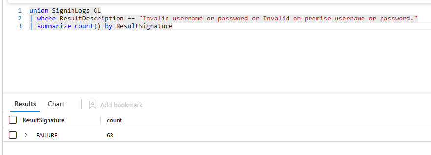

---

### Q6. During the password spray attack, some accounts became locked due to repeated failed attempts. Which user accounts were affected by account lockouts?

**Answer:** `Sarah Miles, Alice Jones`

Filter for below shown Result Description and you can find the users.

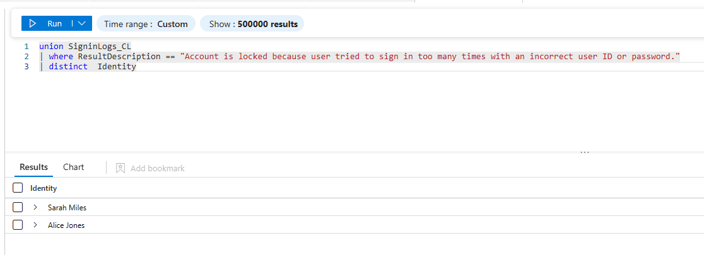

---

### Q7. Create an incident rule and set the authenticationThreshold to the correct value, then analyze the attack pattern. How many unique IP addresses were involved in the password spray attack?

**Answer:** `52`

Filter for IP address with result signature set to failure.

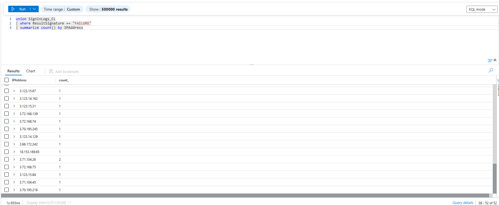

---

### Q8. Determine the exact timestamp when the attackers achieved their first successful authentication after initiating the password spray attack

**Answer:** `2025-07-01 19:21`

Just check for the first successful Login after all the failures

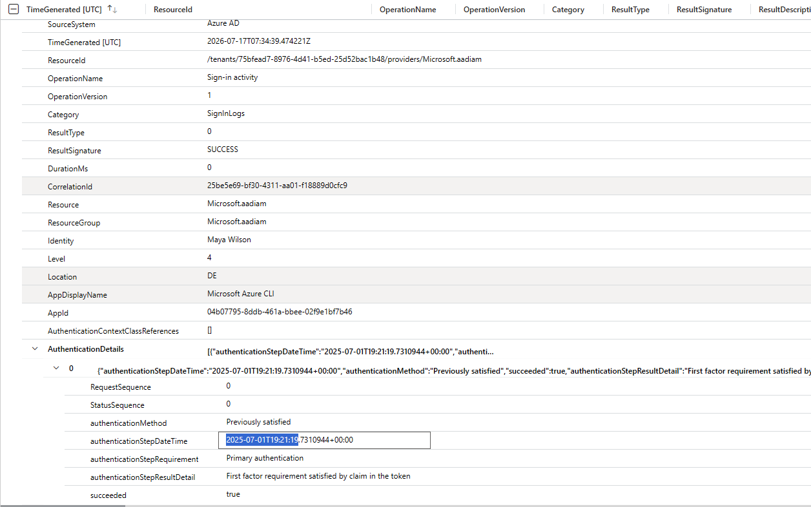

---

### Q9. Identify which user account was successfully compromised during the password spray attack.

**Answer:** `Maya Wilson`

Check for the Identity column from above screenshot

---

### Q10. Examine the technical details of the successful compromise. What User-Agent string was recorded, providing insights into the attacker's browser and operating system?

**Answer:** `Mozilla/5.0 (Windows NT 10.0; Win64; x64) AppleWebKit/537.36 (KHTML, like Gecko) Chrome/138.0.0.0 Safari/537.36 Edg/138.0.0.0 OS/10.0.14393`

Check the same log for UserAgent

---

### Q11. Analyze the non-interactive authentication method used by the attackers. What type of authentication token was leveraged for maintaining access?

**Answer:** `refreshToken`

Review AAD non interactive logs make sure the time alert took place  is after the time Maya Wilson account was compromised

---

### Q12. Calculate the time interval between the initial successful compromise and the first non-interactive authentication event. How many minutes elapsed between these two events?

**Answer:** `4`

---

### Q13. Investigate privilege escalation patterns in the non-interactive authentication logs. Which additional privileged user account shows suspicious non-interactive authentication activity after the initial compromise?

**Answer:** `Tom Clarkson`

---

### Q14. Examine Microsoft Graph API activity logs for reconnaissance behaviors. From which IP address were Graph API queries targeting user enumeration initiated?

**Answer:** `48.211.64.27`

Checking Graph activity logs. majority logs are outside the scoped timeline. So only alerts left are below screenshot

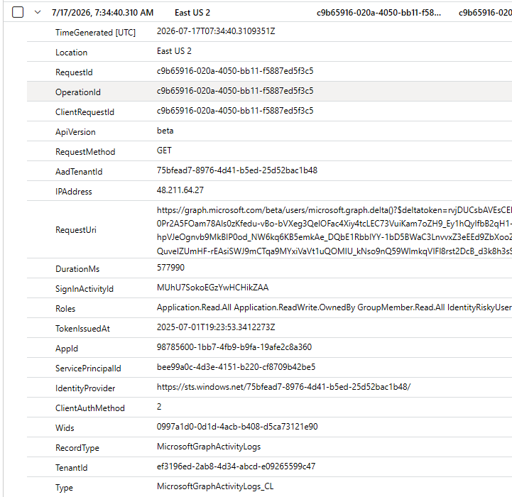

---

### Q15. Identify the specific Graph API endpoint that was queried to perform bulk user enumeration with delta synchronization capabilities.

**Answer:** `/beta/users/microsoft.graph.delta()`

Check Request Uri in the above log you can find the endpoint

---

### Q16. Analyze reconnaissance activities from alternative IP addresses. Besides user enumeration, what other component was targeted for reconnaissance from a different IP address?

**Answer:** `organization`

Check for Request URI of other IP address in the timeline scope

---

### Q17. Investigate Azure resource abuse for persistence mechanisms. What is the name of the Azure Automation account that was compromised and repurposed by the attackers?

**Answer:** `DAILYCHECKER`

Check Diagnostic logs Filter for Resource Provider == MICROSOFT.AUTOMATION

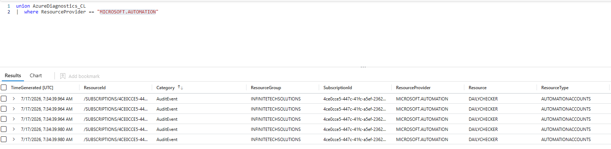

---

### Q18. Examine the malicious automation components created within the compromised account. What is the name of the runbook that was established for persistent access?

**Answer:** `UsersReminders`

Look for logs where OperationName is create.  you will find  a Schedule and a run book is created

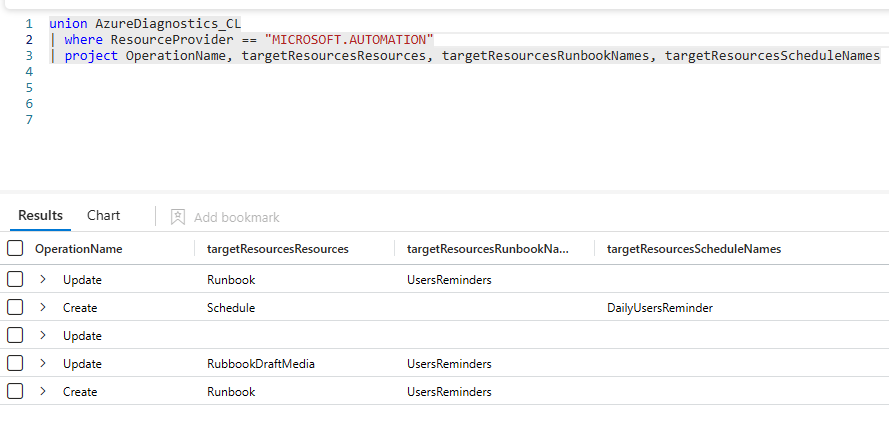

---

### Q19. Analyze the scheduling mechanism for the malicious automation. What is the name of the schedule that was linked to ensure regular execution of the malicious runbook?

**Answer:** `DailyUsersReminder`

As you found from previous query

---

### Q20. Several hours after the initial compromise, attackers performed a significant privilege escalation action. What specific administrative operation was executed to expand their access rights?

**Answer:** `Add owner to application`

If you review logs for operation name "Add owner to application" looks like an action that needs administrative rights

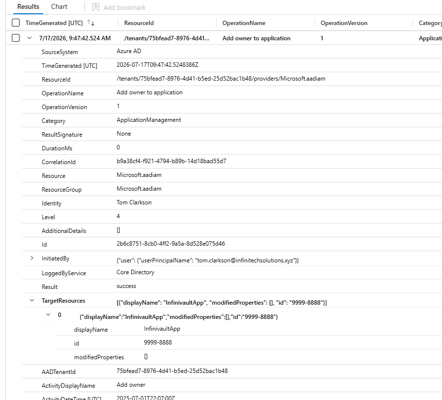

---

### Q21. Identify the target of the privilege escalation activity. Which user account was granted elevated permissions through the administrative action?

**Answer:** `tom.clarkson@infinitechsolutions.xyz`

Check initiated by field

---

### Q22. Examine the application context of the privilege escalation. What unique identifier was assigned to the application that became associated with the newly privileged user?

**Answer:** `9999-8888`

Check Id under target sources in the above log

---

### Q23. After obtaining elevated privileges, attackers attempted to modify existing persistence mechanisms. What specific Azure resource type was targeted for updates within the automation account?

**Answer:** `Runbook`

Look for Diagnostic logs Filter for Resource Provider == MICROSOFT.AUTOMATION where OperationName is update

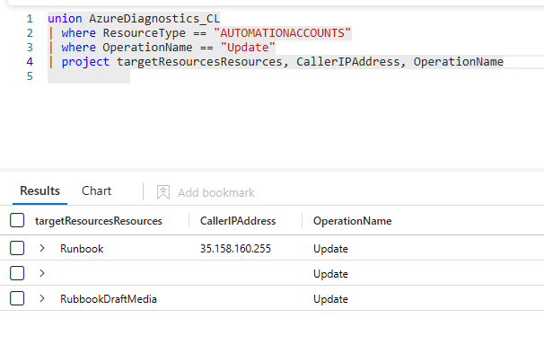

---

### Q24. Trace the source of the persistence modification activities. From which IP address were the automation account updates initiated?

**Answer:** `35.158.160.255`

Same log provides caller Ip address

---

### Q25. Investigate the data exfiltration phase of the attack. Which Azure Key Vaults were accessed during the secret extraction activities?

**Answer:** `CORP-KV-PROD, INFRA-BACKUP-KV, FINANCE-KV-EU`

Filter for VAULTS Resource type and filter for IP address 35.158.160.255 from automation logs

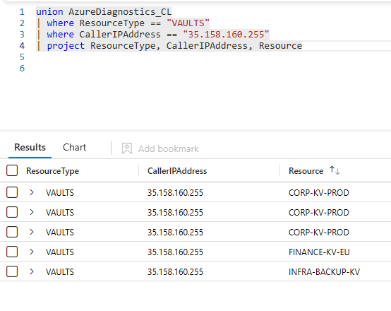

---

Generated with CTF Writeup Builder